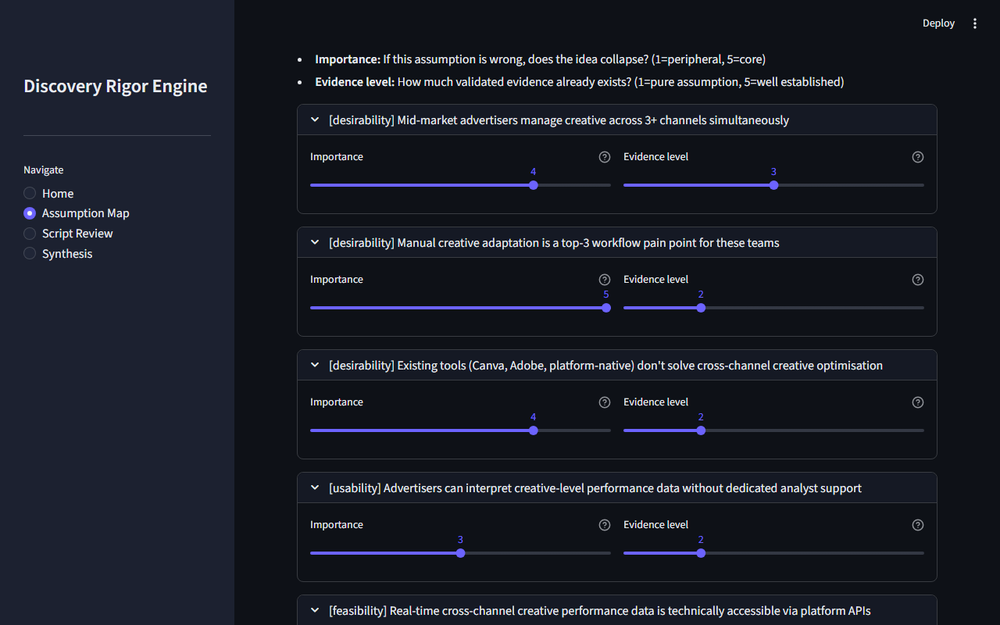
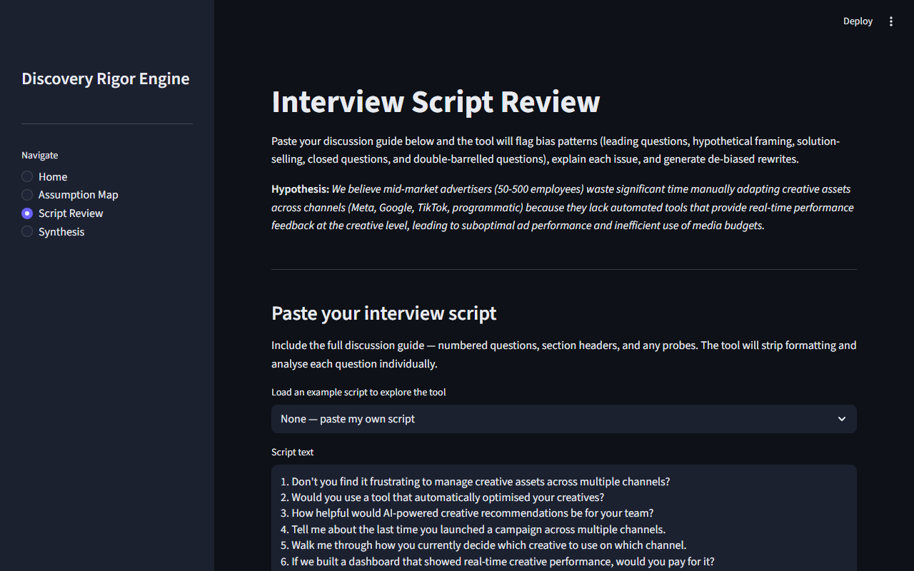
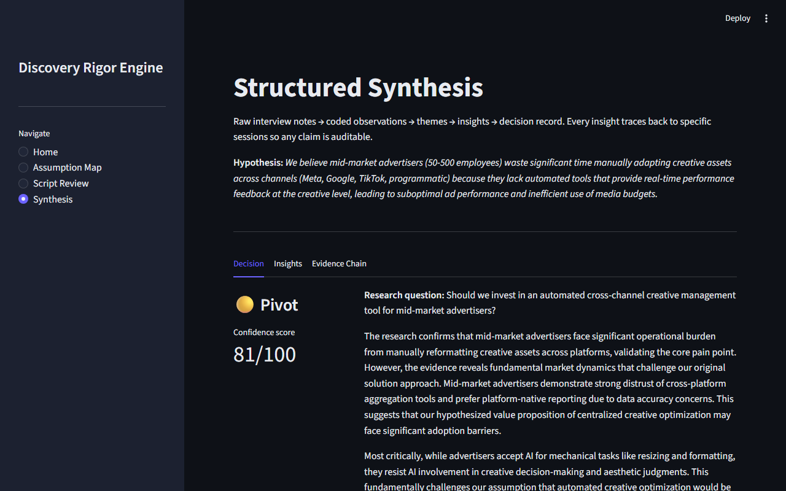
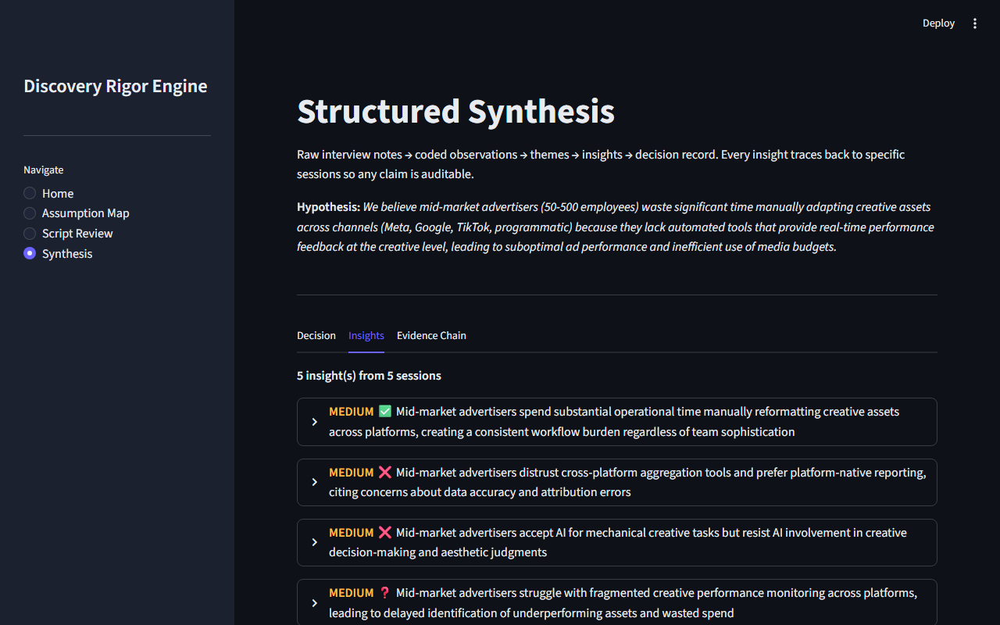
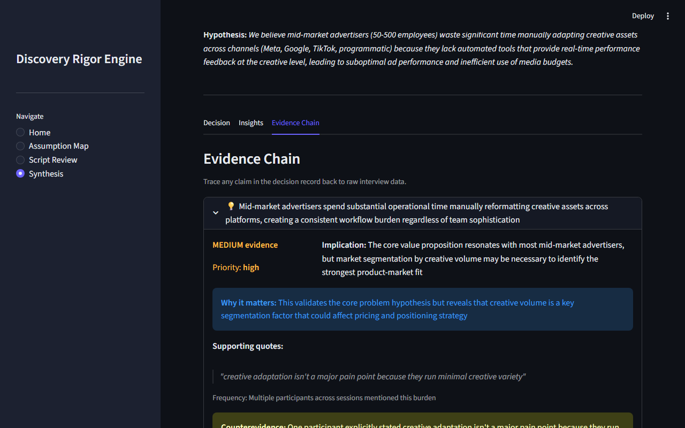
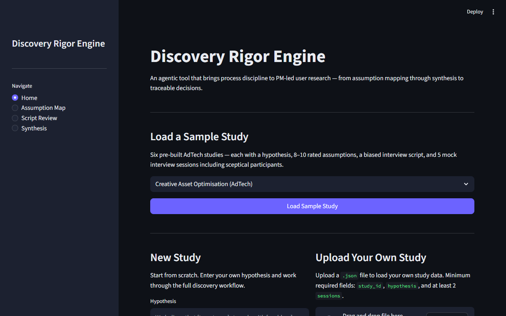

# Discovery Rigor Engine

> An agentic tool that brings process discipline to PM-led user research — from assumption mapping through synthesis to traceable decisions.

---

## The Problem

Product management teams conduct user research that consistently fails to produce decision-grade insights. Not because they lack effort — but because they lack embedded process discipline at the stages where quality actually collapses.

The failure pattern is well-documented and predictable:

**Assumptions go untested.** Teams jump from a vague problem space directly into interviews without identifying which specific beliefs are riskiest. They research what's easiest to test, not what matters most. When the research is done, they can't articulate which assumptions were confirmed, which were challenged, and which were never examined at all.

**Bias contaminates execution.** PMs write discussion guides containing leading questions ("Don't you find it frustrating to…"), hypotheticals ("Would you use a tool that…"), and solution-selling language disguised as research ("If we built X, would you pay for it?"). The resulting positive responses feel like validation — but they're artefacts of how the questions were asked, not evidence of real demand.

**Synthesis is where rigour collapses.** The step between "we did 10 interviews" and "here's what we learned" is typically a black box. Observations get mixed with interpretations. Recency bias means the last two conversations dominate the findings. There is no traceable chain from raw evidence to coded themes to insights to decisions — so when a stakeholder asks "how do we know this?", the answer is "we talked to people and this is what they said."

Existing tools handle the *planning and framing* layer well — problem framing canvases, interview planning guides, opportunity-solution trees. But they stop where the hardest parts begin. There is no tool that carries a PM through execution, synthesis, and decision-traceability with active guardrails at each stage.

## The Solution

The Discovery Rigor Engine fills the gap between research planning and product decisions. It occupies the **execution-to-decision layer** of the user research workflow:

```
[Problem Framing] → [Research Planning] → [ THIS TOOL ] → [Roadmap / Backlog]
   Existing tools       Existing tools     Assumption mapping
   handle this well     handle this well   Execution guardrails
                                           Structured synthesis
                                           Quality scoring
                                           Decision traceability
```

The tool provides three core capabilities, each addressing a specific failure mode:

### 1. Assumption Mapping & Prioritisation

Enter a hypothesis in plain language. The agent decomposes it into discrete, testable assumptions — each tagged by risk lens (desirability, usability, feasibility, viability) — and provides an estimated importance score, evidence level, and one-sentence rationale for each estimate. You adjust these ratings on sliders (starting from the LLM's estimates, not from zero). The tool ranks assumptions by risk and generates a specific research question for every assumption, so every assumption has a testable angle before you enter the field. The full assumption map is downloadable as a Markdown research script.



### 2. Interview Script Guardrails

Paste your discussion guide. The agent analyses every question against a bias taxonomy — leading questions, hypotheticals, solution-selling, closed/binary questions, and double-barrelled questions. Each flagged question gets a plain-language explanation of why it's problematic and a de-biased rewrite grounded in past-behaviour framing. The output is a clean, copyable script with a bias score.



### 3. Structured Synthesis with Decision Traceability

Provide your raw interview notes — by pasting text, uploading `.txt` transcript files, or loading a pre-built fixture. The agent guides them through a rigorous coding process:

- **Open coding** — Extracts discrete observations from each session, tagged as behaviour, statement, or context. Observations are explicitly separated from interpretation.
- **Axial coding** — Clusters observations into themes. Each theme requires support from at least 2 sessions (no single-source themes) and includes a mandatory counterevidence field.
- **Selective coding** — Generates insight statements from themes. Each insight includes: evidence strength, supporting quotes, frequency count, why it matters, which participant segments are most affected, how users currently work around the problem, potential solution directions, and priority/actionability ratings.
- **Decision record** — Produces a structured recommendation (pursue / pivot / park / need more evidence) with a transparent confidence score, tiered next steps (immediate / short-term / long-term), what NOT to do, segment-specific insights, and contradictions/open questions.

Results are displayed across three tabs: **Decision**, **Insights**, and **Evidence Chain**. The evidence chain tab provides a 3-level interactive drill-down: click into any insight to see its supporting themes, click into any theme to see its coded observations, and expand any observation to read the raw session notes it came from.

The full synthesis is exportable as a Markdown decision record. The result: a stakeholder can trace any recommendation backwards through the full chain — from recommendation to insights to themes to observations to raw interview notes.







## Demo

**Live:** [http://Discov-Strea-WVEbKpZIjyJ9-1332689041.us-east-1.elb.amazonaws.com](http://Discov-Strea-WVEbKpZIjyJ9-1332689041.us-east-1.elb.amazonaws.com) — no account or setup required.



The tool comes pre-loaded with **six adtech sample studies** covering creative asset management, audience segmentation, attribution modelling, campaign pacing, creative testing at scale, and cross-channel frequency management. Each includes a hypothesis, 8–10 pre-rated assumptions, a deliberately biased interview script, and 5 mock interview sessions with varied perspectives (including sceptical participants). You can explore the full workflow without entering any data.

### Run locally

Requires: Python 3.11+, AWS credentials configured, and Claude Sonnet 4 model access enabled in AWS Bedrock (us-east-1).

```bash
git clone https://github.com/[your-username]/discovery-rigor-engine.git
cd discovery-rigor-engine
python -m venv .venv
source .venv/bin/activate   # Windows: .venv\Scripts\activate
pip install -r requirements.txt

# Configure AWS credentials (used for Bedrock LLM calls)
aws configure

# Run
streamlit run app.py
```

### Deploy to AWS

Deploys the full stack (ECS Fargate + ALB + DynamoDB + S3 + ECR) with a single command. Requires Docker, AWS CDK, and a bootstrapped AWS account.

```bash
cd infrastructure/
pip install -r requirements.txt
cdk bootstrap   # one-time per account/region
cdk deploy      # prints the public URL on completion
```

## How It Works

### Architecture

The system is built on a **LangGraph StateGraph** with three sub-flows branching from an entry router. Each sub-flow chains LLM reasoning nodes with deterministic validation and scoring nodes.

```
Entry Router (deterministic)
    ├── Assumption Mapping — phase 1
    │     decompose_hypothesis (LLM — includes estimated scores + rationales)
    │     → categorise_risk_lens (LLM) → END
    │     [user rates assumptions in Streamlit, then triggers phase 2]
    ├── Assumption Mapping — phase 2
    │     compute_risk_scores (deterministic)
    │     → generate_research_questions (LLM, all assumptions) → END
    ├── Script Review
    │     parse_questions (deterministic)
    │     → analyse_bias (LLM, per question)
    │     → rewrite_questions (LLM, flagged questions only)
    │     → assemble_clean_script (deterministic) → END
    └── Synthesis
          ingest_notes (deterministic)
          → open_coding (LLM, per session)
          → axial_coding (LLM, all observations)
          → selective_coding (LLM, themes → insights)
          → decision_record_node (LLM narrative + deterministic scoring) → END
```

**Design principle: LLM for reasoning, deterministic for rigour.** The LLM handles tasks requiring judgment — decomposing hypotheses, detecting bias patterns, clustering observations, generating narratives. Deterministic logic handles everything where consistency matters — risk score calculations, the 2-session minimum for themes, confidence score computation, and traceability chain validation. This means the guardrails and quality controls are reproducible and auditable, not dependent on LLM mood.

### Data Traceability Chain

The core value is the traceable chain. Every entity links backwards:

```
Decision Record
  └── Insights
       └── Themes (≥2 sessions required, counterevidence mandatory)
            └── Observations (tagged: behaviour | statement | context)
                 └── Sessions (raw interview notes)
                      └── Study + Assumptions
```

### Confidence Score

The confidence score (0–100) on the decision record is fully deterministic and transparent:

| Component | Weight | What it measures |
|-----------|--------|-----------------|
| Evidence strength | 40% | Average strength of supporting insights (high=1.0, medium=0.6, low=0.3) |
| Theme saturation | 25% | Proportion of tested assumptions covered by themes |
| Counterevidence coverage | 20% | Proportion of themes with populated counterevidence |
| Session diversity | 15% | Proportion of sessions referenced in the final analysis |

The breakdown is shown alongside the score so stakeholders can see exactly what drives the confidence level.

## Sample Walkthrough

Using the pre-loaded adtech fixture:

1. **Load a sample study** — Choose from 6 pre-built studies on the home page, or upload your own JSON. "Creative Asset Optimisation for Mid-Market Advertisers" is the primary fixture.
2. **Explore the assumption map** — 10 assumptions across desirability, usability, feasibility, and viability. Sliders start at LLM-estimated scores with rationale captions underneath. Research questions are generated for every assumption. Download the full map as a Markdown research guide.
3. **Review the biased script** — The sample discussion guide contains 6 deliberately problematic questions alongside 4 clean ones. Load one of 5 example scripts from the dropdown, or paste your own. Watch the agent flag leading questions, hypotheticals, and solution-selling patterns, then generate de-biased rewrites.
4. **Run synthesis** — Add sessions by pasting notes, uploading `.txt` transcripts (named `P1.txt`, `P2.txt` etc. for auto-detection), or use the pre-loaded 5 sessions. Watch node-level progress in a live status panel. Themes emerge with supporting and counterevidence.
5. **Read the decision record** — A structured recommendation with confidence score, tiered next steps, what NOT to do, segment insights, and contradictions. Explore the Insights tab for rich insight cards with participant quotes, frequency counts, workaround patterns, and solution directions. Click through the Evidence Chain tab to trace any claim back through themes → observations → raw session notes.
6. **Export** — Download the full decision record or research script as Markdown.

## Product Decisions

These are the deliberate scoping trade-offs. They're the section of this README that's most important for understanding the product thinking behind this project.

### What's in and why

| Decision | Rationale |
|---------|-----------|
| **Three capabilities, not seven** | The research playbook identified 7 capability areas. The MVP builds 3 that chain together into one demo narrative (map → review → synthesise → decide). An end-to-end story is more compelling than breadth at 30% depth. |
| **Streamlit over CLI** | The outputs are visual — assumption maps, bias-annotated scripts, traceable synthesis chains. A CLI would force users to imagine what these look like. |
| **In-memory locally, DynamoDB when deployed** | Zero setup friction for local runs. The deployed version uses DynamoDB so state persists across sessions. |
| **Pre-loaded adtech sample data** | The tool must be explorable without requiring users to create data from scratch. The adtech fixture provides a complete, realistic scenario to walk through immediately. |
| **LangGraph over simple function chaining** | This could be built as sequential function calls. LangGraph adds complexity — but it's complexity that demonstrates understanding of agentic architecture, state management, and human-in-the-loop patterns. The architecture is the point. |
| **Hybrid LLM + deterministic** | Pure LLM would be non-reproducible. Pure rules would be brittle. LLM for reasoning, deterministic for scoring and validation — a deliberate reliability/flexibility trade-off. |

### What's out and why

| Decision | Rationale |
|---------|-----------|
| **No persistent database** | Adds setup friction without demo value. Revisit for the research repository feature in v2. |
| **No .docx / PDF / audio upload** | `.txt` transcript upload was added in v1.1 (Synthesis page). Richer formats (docx, PDF, audio transcription) remain a v2 feature. |
| **No real-time interview companion** | Architecturally different (streaming, WebSocket, voice). The MVP handles before-interview (script review) and after-interview (synthesis), not during. |
| **No ethics/consent workflow** | Critical for production but adds complexity without demo impact. |
| **No multi-user / team features** | Weekend scope. The tool models a single PM's workflow. |

### Risks accepted

| Risk | Mitigation |
|------|-----------|
| LLM hallucination in synthesis | Every insight requires linked observation IDs. The UI shows the full chain. Any claim can be verified. |
| Bias detection accuracy | A test set of 20 known-bad + 10 known-clean questions establishes a measurable baseline. Accuracy is reported transparently. |
| "Just a wrapper around an LLM" perception | The deterministic scoring, enforced quality gates (2-session minimum, counterevidence fields), structured data model, and traceable chain are all non-LLM value. |

## Roadmap

### v2 — Research Quality Platform

| Capability | Description |
|-----------|-------------|
| **Full Quality Rubric** | Standalone scoring across 6 dimensions (decision clarity, signal strength, participant relevance, bias control, actionability, efficiency) with 1–5 anchored scales. |
| **Research Repository** | Persistent storage with tagging taxonomy. Duplicate-detection alerts when a new study overlaps with existing research. |
| **Method Recommender** | Given a decision type and risk lens, recommend optimal research methods from the full taxonomy (contextual inquiry, diary studies, usability tests, surveys, A/B tests) with sample size heuristics. |
| **Ethics & Consent Module** | GDPR-aware consent script generator, data minimisation checklist, special category data warnings. |
| **File Upload & Transcription** | Accept .docx, .pdf, and audio files as session inputs. |

### v3 — Team & Integration

| Capability | Description |
|-----------|-------------|
| **Multi-user collaboration** | Shared studies, role-based access, comment threads on insights. |
| **Tool integrations** | Export to Jira/Linear, Notion, Figma. |
| **Real-time interview companion** | Live transcription + bias detection during interviews. |
| **Automated saturation detection** | After each new session, calculate whether new themes are still emerging or the study has reached theoretical saturation. |

## Tech Stack

| Component | Choice | Why |
|-----------|--------|-----|
| Orchestration | LangGraph | Graph-based state management maps naturally to multi-step research workflows. Demonstrates agentic architecture. |
| LLM | Claude Sonnet 4 via AWS Bedrock | IAM-authenticated (no API key to manage), same model quality, consistent with the AWS deployment. Swappable via single wrapper file (`src/llm.py`). |
| UI | Streamlit | Fast to build, visual outputs, widely understood. |
| Language | Python 3.11+ | LangGraph/Streamlit native. Readable for both technical and non-technical contributors. |
| Storage | In-memory (local) / DynamoDB (deployed) | Zero-friction local setup. DynamoDB in the deployed version for persistence across sessions. |
| Hosting | ECS Fargate + ALB | ALB natively supports WebSocket (required by Streamlit). Single `cdk deploy` command. |


